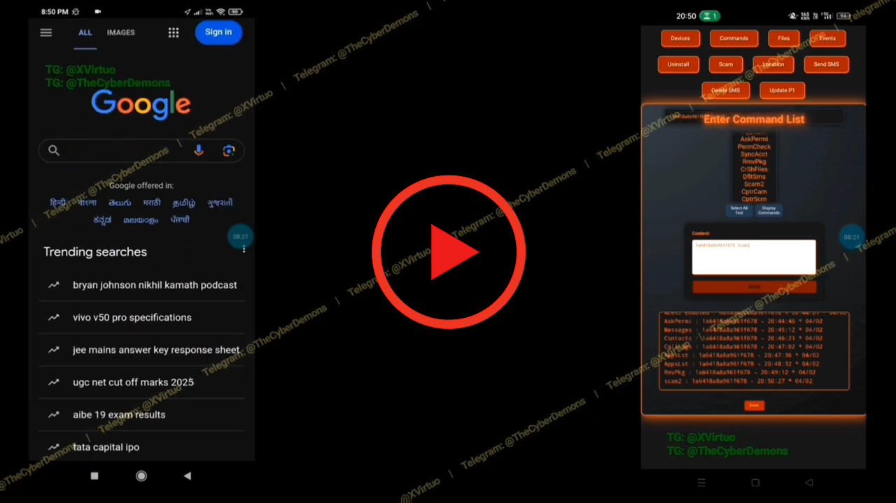

# Most Powerful (FUD Android RAT) 2026
## web based - no pc required

## Features:
  - No F*** Accessibility Restrictions. 
  - Bypass miui and other Chinese ROMs extra permissions (autostart, background restrictions and ect) to work the payload properly. hell yeah - no one made this possible in history yet.
  - Powerful Sophisticated Dropper module
- R*ns*mware:
  - Prevent device usage 
  - Display custom Rans*m Message
  - Encrypt files with custom rans*m note
- Keylogger: Offline/Online  
- Hijack any credentials (bank accounts, crypto wallets, KYC, P2P accounts)  
- Powerful Live Screen Controls (Lag free)
- Capture all keystrokes
- Capture any 2FA codes  
- Stable and encrypted connection  
- Anti-VM & Emulator  
- Automatically grant all permissions  
- Hide icon/Change icon
- enject dropper into any legimate apk
- Place calls & dial USSD codes  
- Record calls  
- Delete call logs
- View all call logs  
- Send SMS  
- Send Bulk (multiple) SMS  
- Receive SMS & OTPs
- Fetch All SMS
- Delete SMS  
- Edit SMS (SMS Sender info & Content) Spoof SMS
- Access accounts (Gmail, Telegram All Type Accounts)
- View contact lists  
- View & Download user installed and system App List
- View files and folders  
- Download files and folders
- Delete Create Dirs & Files
- Capture photos  
- Capture videos  
- Capture audio  
- Take screenshots  
- Capture screen recordings (with or without audio)  
- Install and uninstall any app 
- update payload
- Get accurate realtime GPS location 
- exclude include packages live to capture Keystrokes 
- Watch live feeds from both front and back cameras  
- Show Toast
- Freeze Unfreeze Accessi 
- Admin Privileges
- Prevent any app access - crash google playstore whatsapp or antivirus with fake dialog and close it.
- Lock Unlock or Erase Device.
- True Zero Detect & Bypass Antivirus 
- Capture Notifications & OTPs (No f nedd to enable noti listner)
- Capture All Keystrokes including 2FAs
- Hij*ck Crypto - Past Your Address to clipbord
- Get All Clipboard Text
- SC*M Ph*shing - Send Spoof Notification of any user installed app or system app (banking crypto WhatsApp telegram anything) when user open the notification it will create exact clone of any app including the notification.
- Powerful Droppers (Unrestricted) to bypass Google Play Protect & Security restriction settings from android 13.
- Works on Android 7 to 16.
- And Much Much More...
---

## What’s Special About Our RAT?

- Payload Delivery: Uses legitimate apps to drop the payload, making it impossible for detect.

- Fully Encrypted Communication: fully encrypted connections to the C2C server. Unlike CrsRAT, it does not obfuscate your IP address and port number in simple base64 strings. Our approach makes it impossible to obtain your IP. We use special techniques to properly hide it. Trust me, your C2C IP will not be found in the code after decompiling the APK file.

- Advanced Stealth Techniques: 
Eva*de antivirus detection permanently. Our RAT cannot be detected by any antivirus or VirusTotal scans for a lifetime. Without these protections, any RAT can become detectable within a few weeks or months of distribution.

- Not Affected by Ultra Battery Optimizations: Unlike other RATs, ours isn’t killed by ultra battery-saving modes, boost modes, or booze mode found in Chinese ROMs and others. These ROMs often revoke battery optimization permissions after a reboot or after some time, even if granted earlier.

- Fully Persistent & Undetectable After Installation: Optimized to run using minimal RAM and system resources, it does not send unnecessary connections like CraRAT, which can be flagged by Android devices or raise user suspicion. It always runs calmly in the background, using minimal resources and battery.

- Anti-Emulator and VMware Detection: Our RAT employs a highly specialized and unique method to detect and block emulators and virtual machines. Unlike other RATs that can be bypassed in a few known virtual environments, ours is specially designed to run only on real devices, ensuring it is undetectable and inoperable in any simulated environment. This unique, powerful, proprietary technique guarantees the RAT will run only on real hardware.

- Hij*ck Any Cred*ntials: Access live codes of 2FA authenticators. Special techniques capture 2FA codes when required. Currently supports all known authenticators like Google, Microsoft, 2FAS, and LastPass.

- Freeze Mode: In Freeze Mode, it sends and receives a total of only 1–3MB of data in 24 hours, ensuring an immediate response when commands are sent.

- Portable RAT: No PC required. Control the vict*m’s device using an Android device, Linux, or Windows—only a browser is needed.

- No Port Forwarding Required: Once installed on a victim’s device, you can control the devices (Android 7 - 16) indefinitely.

---

## Pricing / Contact Information

- **Telegram:**  
  Admin: [https://t.me/XVirtuo]  
  Channel: [https://t.me/TheCyberDemons]  

## Video Links

- **Video 1:** [https://youtu.be/LiQ5pdvHW3k]  
- **Video 2:** [https://youtu.be/B7sEH1H9cfo]  
- **Installation Guide:** []

---

- Languages Used: Java on the client side and PHP on the server side.  

- Encryption: Uses AES-128-CBC with PKCS padding for secure data encryption and communication.

- Code Obfuscation:** The code of payload & Dropper is obfuscated using very unique and advanced encryption methods, making it impossible to reverse engineer or detect.

---

## Warning & Disclaimer:

This content is strictly for educational and research purposes only. It is intended to help cybersecurity professionals, ethical hackers, and researchers understand modern threats to improve defensive security measures.

Unauthorized use of malware, RATs, or hacking tools to compromise systems without explicit permission is illegal and punishable under cybersecurity laws. Engaging in malicious activities such as unauthorized access, data theft, or financial fraud can lead to severe legal consequences.

If you are a cybersecurity professional or student, always conduct security research responsibly within legal and ethical boundaries. Use this knowledge to protect systems, educate users, and strengthen cybersecurity defenses—not for malicious purposes.
---- Please Support Us Guys ----